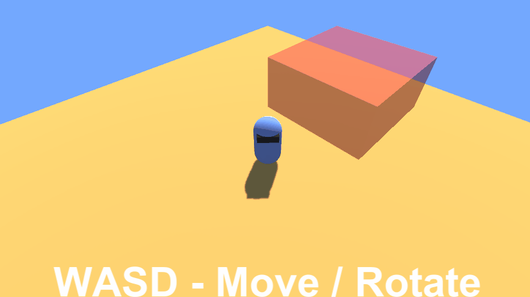
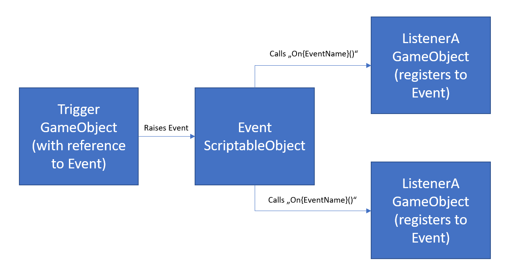

# Event for Unity
A Unity3D package for triggering and handling events. Based heavly on https://unity.com/how-to/architect-game-code-scriptable-objects#code-example-gameevent-scriptableobject.

## Example

## Features
- Events as ScriptableObjects
- Event dispatching via messages and UnityEvent

## Install
Download and copy the Plugins directory from this repository to your project.

## Quickstart
1. Create event: Assets/Create/DonUrks/GameEvent named "MyFirstEvent"
2. Prepare trigger: add `public DonUrks.Event.GameEvent triggerMyFirstEvent;` property to your triggering script
3. Place event: drop the "MyFirstEvent" asset in the Inspector to your triggering script component
4. Trigger event: call `triggerMyFirstEvent.Raise(this)` in your triggering script
5. Prepare Listener: add DonUrks.Event.GameEventListener component to your listening GameObject
6. Register event: drop the "MyFirstEvent" asset in the Inspector to your GameEventListener component

Now every time MyFirstEvent is raised, every `OnMyFirstEvent(Object sender)` method in your components of your listening GameObject is called.

## Sample
Open the Event/Sample/SampleScene and press play.

## Components
### DonUrks.Event.GameEvent
- ScriptableObject for events
- Name is used as method name

### DonUrks.Event.GameEventListener
- Component for listening to events
- Property Event: register a specific event (Note: you can add multiple listener components to a GameObject)
- Property messageType: 
	- None: no messages
	- SendMessage: calls "On{EventName}" on all components of current GameObject
	- BroadcastMessage: like SendMessage but calls also on all children
- Property Response: set custom method calls via Inspector

